<h1 align="center">Hi 👋, I'm S. M. S. Morsalin</h1>
<h3 align="center">
  <a href="https://git.io/typing-svg">
    
  </a>
</h3>

# 💫 About Me:
**Computer Science Student | Tech Enthusiast**<br><br>I am currently pursuing my degree in CSE at **Independent University, Bangladesh**. I love exploring how things work under the hood and building efficient software.<br><br>* 🏫 **Student:** Independent University, Bangladesh (IUB)<br>* 💻 **Major:** Computer Science and Engineering<br>* 🌱 **Learning:** Data Structures, Algorithms, Networking, AI and Cyber Security<br>* 💬 **Ask me about:** Python<br>* 📫 **Reach me:** smsmorsalin1@gmail.com


## 🌟 Contributions:


### 💻 Coding Profiles:

[](https://toph.co/u/sms_morsalin)
[](https://leetcode.com/u/smsmorsalin/)
[](https://hackerrank.com/smsmorsalin)
[](https://codeforces.com/profile/smsmorsalin)

# 💻 Tech Stack:
            

## ⏱️ Coding Activity

<!--START_SECTION:waka-->

```txt
From: 23 August 2026 - To: 30 August 2026

Total Time: 0 secs

No activity tracked
```

<!--END_SECTION:waka-->

<div align="center">

[](https://wakatime.com/@3df21c7c-4db0-4284-a0cb-db69decb69f0)

</div>

---

## 📊 GitHub Activity

<div align="center">




</div>

<br>

<div align="center">


</div>
---
<br>

## 🎧 Currently Vibing

<div align="center">

[](https://open.spotify.com/user/31yhzz72vuvnvf3yvekawbpua5ru)

</div>


## 🤝 Let's Connect

I'm always interested in learning, collaborating on interesting projects, and connecting with other developers.

<div align="center">

[](https://facebook.com/smsmorsalin) [](https://instagram.com/smsmorsalin) [](https://linkedin.com/in/smsmorsalin) [](https://x.com/morsalinsms) [](mailto:smsmorsalin1@gmail.com) 

</div>

<div align="center">

### 💡 `Code. Learn. Build. Repeat.`


⭐ **Thanks for visiting my profile!**

</div>


